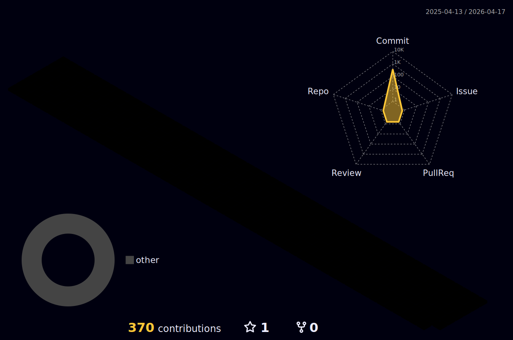

<!---->

<!-- ### Hi there 🐣👋 -->
<!--
**taejungsu/taejungsu** is a ✨ _special_ ✨ repository because its `README.md` (this file) appears on your GitHub profile.

Here are some ideas to get you started:

- 🔭 I’m currently working on ..
- 🌱 I’m currently learning ...
- 👯 I’m looking to collaborate on ...
- 🤔 I’m looking for help with ...
- 💬 Ask me about ...
- 📫 How to reach me: ...
- 😄 Pronouns: ...
- ⚡ Fun fact: ...
-->

  
 
  

  <!-- 

 -->

---

### :man_technologist: About Me:
🎓 B.S:Department of Artificial Intelligence & Software at Sunmoon University (2018.03 ~ 2025.02)
<!-- I am a Software Developer  in Japan.

- :telescope: I’m working as a Software Engineer and contributing to mainly backend (sometimes frontend too) for building web applications.

- :satellite: I also have experiences in Machine Learning and Data Engineering fields.

- :seedling: Exploring Technical Content Writing.

- :zap: In my free time, I work on personal projects. -->

### Project List

| Project Logo | Project Link | Summary |
| :---: | :---: | :---: |
|  | [Link](https://github.com/2024-2-JAVA/PBL-Module-2) | This project is a calculator program using Java. |
|  | [Link](https://github.com/taejungsu/bigdata_contest) | This project is provide insight into infectious disease problems through big data analysis |
|  | [Link](https://github.com/taejungsu/SM_Project) | Analyze the traffic data and clustering the traffic accident danger zone based on traffic data insight |
|  | [Link](https://github.com/taejungsu/SW_Project) | Web site development project with coordination recommendation system |
| On going| | |

---

### :hammer_and_wrench: Languages and Tools :

  &nbsp;
  &nbsp;
  &nbsp;
  &nbsp;
  
  
  
  
  &nbsp;
  &nbsp;
  &nbsp;
  &nbsp;
  &nbsp;
  &nbsp;
  &nbsp;
  &nbsp;
  &nbsp;
  &nbsp;
  &nbsp;

---

### 👨🏻‍💻 My Stats

---

### 🤖Online Judge:

  

<!-- BLOG-POST-LIST:START -->
<!-- BLOG-POST-LIST:END -->
